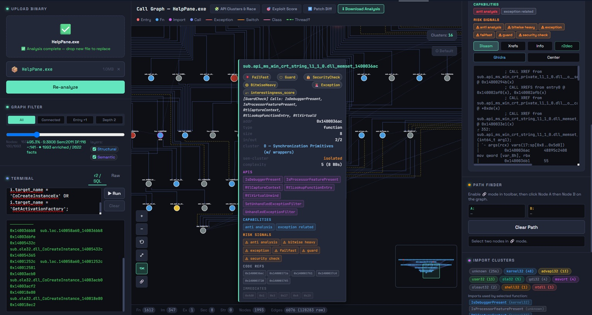
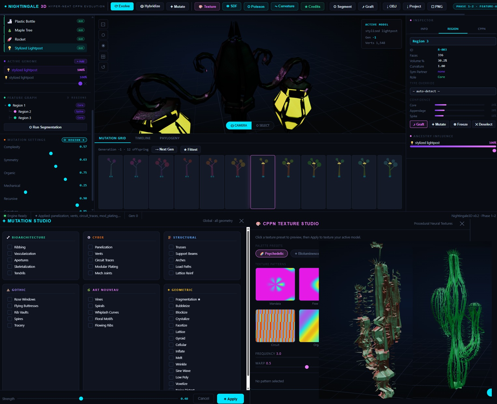
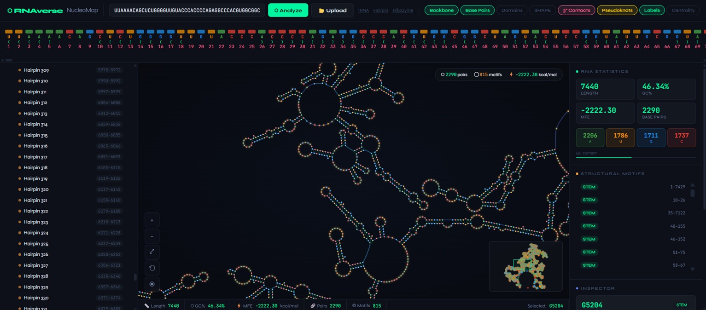
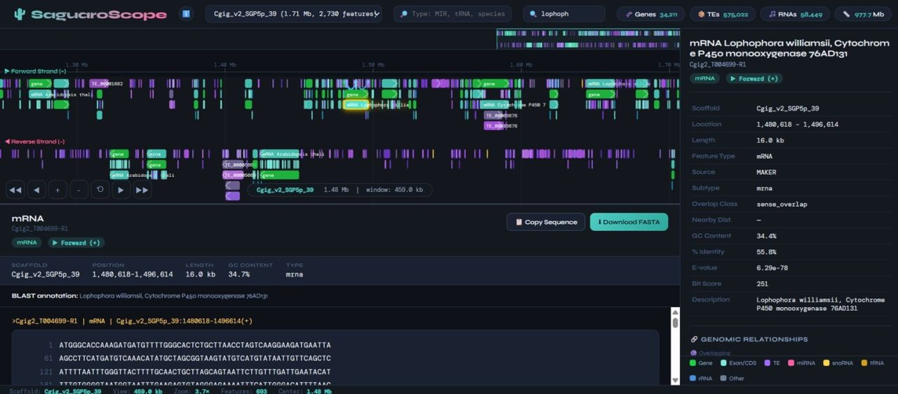

<h1 align="center">🍌 400lbhacker 🍌</h1>

<p align="center">
<em>Reverse Engineering • Binary Analysis • Security Research • Systems Engineering</em>
</p>

---

## 🧠 About

I build analysis platforms that help understand complex software at scale.

My work focuses on reverse engineering, binary analysis, malware research, program visualization, and automation. Most of my projects are built from scratch around large datasets, graph analysis, and interactive tooling rather than simple proof-of-concepts.

Current areas of interest include:

- Binary analysis & reverse engineering
- Program graph construction and visualization
- Static + dynamic analysis pipelines
- Vulnerability research
- Malware analysis & behavioral clustering
- OSINT and security automation
- Bioinformatics visualization
- Generative algorithms (CPPN / HyperNEAT)

I enjoy building tooling that makes difficult technical problems easier to explore.
---

## 🎯 Areas of Expertise

- Reverse Engineering
- Malware Analysis
- Static Binary Analysis
- Dynamic Analysis & Debugging
- Program Graph Construction
- Call Graph Recovery
- Control Flow Analysis
- Binary Visualization
- SQL-backed Program Analysis
- Vulnerability Research
- Python Automation
- Interactive Data Visualization
- Bioinformatics Tool Development
- Evolutionary Algorithms
- AI-assisted Security Research

- # 🚀 Featured Projects

| Project | Description |
|---------|-------------|
| **Binary Atlas** | Interactive reverse engineering platform for large-scale binary analysis with graph visualization, clustering, SQL querying, and AI-assisted exploration. |
| **Nightingale 3D** | HyperNEAT/CPPN evolutionary design engine for procedural 3D model generation, hybridization, mutation, and texture synthesis. |
| **RNAverse** | RNA secondary structure visualization platform with RNAfold/RNAplot integration, motif discovery, mutation simulation, and AI-assisted interpretation. |
| **SaguaroScope** | Interactive genome browser for the saguaro cactus with BLAST annotations, DuckDB-backed genomic search, sequence extraction, and pathway visualization. |


# Binary Atlas



<p align="center">
  <strong>Interactive Binary Intelligence Platform</strong><br>
  Reverse Engineering • Call Graph Analysis • Vulnerability Discovery • API Correlation • Graph Exploration
</p>

<p align="center">


</p>

---

## What is Binary Atlas?

Binary Atlas is an interactive reverse engineering and vulnerability research platform that transforms raw binaries into an explorable intelligence graph.

Instead of manually navigating thousands of functions inside a disassembler, Binary Atlas builds a searchable knowledge graph linking:

- Functions
- Imports
- API usage
- Wrappers & thunks
- Call relationships
- Security-relevant behaviors
- Clusters
- Risk indicators
- Cross references
- Semantic categories

The result is a system that allows researchers to move from:

```text
Binary
   ↓
Disassembly
   ↓
Function Graph
   ↓
Behavior Graph
   ↓
Vulnerability Discovery
```

---

# Core Capabilities

## Interactive Call Graph

Explore thousands of functions in real time.

- Function-to-function call relationships
- Import ownership mapping
- Recursive traversal
- Path finding
- Connected component exploration
- Entry point discovery
- Cluster visualization

```text
QuarantineLocation
      ↓
MoveFileWrapper
      ↓
MoveFileExW
```

Instead of hunting through hundreds of disassembly windows, the relationship is visible immediately.

---

## API Intelligence

Binary Atlas automatically categorizes APIs into behavioral groups.

Examples:

### Filesystem

- CreateFileW
- DeleteFileW
- MoveFileExW
- CopyFileExW
- ReadFile
- WriteFile

### Registry

- RegOpenKeyExW
- RegSetValueExW
- RegDeleteKeyW

### Networking

- WinHttpOpen
- WinHttpConnect
- WinHttpSendRequest

### Threading

- CreateThread
- Sleep
- ExitThread

### Synchronization

- CreateMutexW
- SetEvent
- WaitForSingleObject

### Anti-Analysis

- IsDebuggerPresent
- QueryPerformanceCounter
- GetTickCount
- OutputDebugStringW

---

## Security Signal Detection

Binary Atlas automatically highlights suspicious behaviors.

Examples:

- Anti-debugging
- Security checks
- Fail-fast logic
- Exception-heavy routines
- Bitwise-heavy code
- Guard logic
- Wrapper functions
- Process interaction
- File-system modification chains

---

## Import Ownership Analysis

Automatically discovers:

```text
Function
      ↓
Wrapper
      ↓
Import
```

Examples:

```text
QuarantineLocation
      ↓
MoveFileWrapper
      ↓
MoveFileExW
```

This is extremely useful when analyzing:

- Malware
- EDRs
- AV engines
- Windows services
- Enterprise software

where API calls are often hidden behind dozens of wrappers.

---

## Semantic Clustering

Functions are grouped based on observed behavior.

Example clusters:

```text
Filesystem
Networking
Registry
Crypto
Memory
Threading
Synchronization
Injection
Anti-Analysis
Execution
```

Rather than viewing 1,000+ isolated functions, analysts can navigate the binary at a subsystem level.

---

## Vulnerability Discovery

Binary Atlas assists vulnerability research by automatically identifying:

### Race Conditions

```text
Lock
 ↓
Release
 ↓
Shared Object
 ↓
Reacquire
```

### TOCTOU Candidates

```text
Check
 ↓
Use
```

### Dangerous File Operations

- MoveFileExW
- DeleteFileW
- CreateFileW

without:

- GetFinalPathNameByHandleW
- PathFileExistsW
- Validation routines

### Memory Risks

- HeapFree
- VirtualProtect
- HeapReAlloc
- FreeLibrary

### Privileged Operations

- OpenProcess
- ReadProcessMemory
- CreateProcessAsUserW

---

## XREF Exploration

Instantly pivot between:

```text
Import
 ↓
Wrapper
 ↓
Caller
 ↓
Caller of Caller
```

Find:

- Who calls this?
- What does it call?
- Where does data originate?
- Which subsystem owns it?

---

## Offline SQL Analysis

Every analysis exports to SQLite.

Researchers can perform custom investigations:

```sql
SELECT *
FROM instruction_refs
WHERE target_name='MoveFileExW';
```

```sql
SELECT *
FROM functions
WHERE risk_score > 80;
```

```sql
SELECT *
FROM edges
WHERE type='call';
```

Perfect for:

- Research
- Automation
- Reporting
- CI pipelines
- Large-scale binary comparison

---

## Graph-Based Investigation

Ask questions such as:

### Filesystem

> Show every path leading to MoveFileExW

### Networking

> Show all WinHTTP consumers

### Registry

> Find registry write chains

### Threading

> Show thread creation entry points

### Security

> Find all anti-analysis functions

### Vulnerability Research

> Find file operations lacking validation

---

## Binary Intelligence Dashboard

Binary Atlas provides immediate visibility into:

- Functions
- Imports
- Exports
- Sections
- Clusters
- Graph density
- Security indicators
- Risk score
- API ownership
- Call relationships

without requiring users to manually traverse thousands of nodes.

---

# Designed For

- Reverse Engineers
- Malware Analysts
- Vulnerability Researchers
- Security Engineers
- Detection Engineers
- Incident Responders
- Threat Hunters
- Red Team Operators
- Software Security Researchers

---

# Long-Term Vision

Traditional workflows separate:

```text
Disassembler

Debugger

Decompiler

Database

Notes

Graphs
```

Binary Atlas aims to unify them into a single intelligence platform.

Future directions include:

- Dynamic execution correlation
- Time-travel debugging integration
- Runtime call graph augmentation
- Taint analysis
- Symbolic execution
- Automatic exploit path discovery
- AI-assisted vulnerability triage
- Graph-based patch analysis
- Binary diffing
- Cross-version behavioral comparison

---

# Philosophy

> Stop reading binaries one function at a time.
>
> Start exploring them as systems.

---


# Nightingale 3D Engine



<p align="center">
  <strong>🧬 Neuroevolution for Procedural 3D Generation</strong><br>
  <em>HyperNEAT • CPPNs • Genetic Algorithms • Evolutionary Design • Interactive Mesh Synthesis</em>
</p>

---

<p align="center">


</p>

---

# 🧠 Overview

**Nightingale 3D Engine** is an experimental evolutionary modeling platform that treats **3D objects as genomes instead of static meshes**.

Rather than sculpting vertices manually, objects are generated and evolved through **HyperNEAT**, **Compositional Pattern Producing Networks (CPPNs)**, and **genetic algorithms**, allowing entirely new forms to emerge through mutation, crossover, and procedural growth.

Instead of asking:

> *"How do I model this?"*

the engine asks:

> **"How could this evolve?"**

Every object becomes an organism with inheritable traits, enabling procedural evolution instead of traditional mesh editing.

---

# ✨ Core Features

## 🧬 HyperNEAT & CPPN Procedural Generation

Generate geometry from neural networks instead of handcrafted meshes.

Features include:

- CPPN-based implicit geometry generation
- HyperNEAT substrate evaluation
- Continuous procedural shape generation
- Infinite variation without manually editing vertices
- Deterministic reproduction from genomes

Every generated model is reproducible from its genome.

---

## 🧬 Evolutionary Hybridization

Unlike conventional procedural generators that create one object at a time, Nightingale allows multiple organisms to breed together.

The engine supports:

- Multi-parent crossover
- Genome recombination
- Trait inheritance
- Regional feature blending
- Controlled diversity
- Evolutionary branching

A cactus can inherit characteristics from architecture.

A rocket can inherit characteristics from a tree.

Every generation produces new offspring instead of simple copies.

---

## 🧪 Genetic Mutation Engine

Every offspring can be procedurally mutated.

Mutation operators include:

- geometry perturbation
- recursive growth
- symmetry breaking
- complexity adjustment
- proportional scaling
- topology variation
- regional mutation
- genome noise injection

The result is an evolutionary search instead of random mesh distortion.

---

# 🌳 Evolution Timeline

Every generation is preserved.

The engine records:

- parent relationships
- mutation history
- offspring lineage
- ancestry influence
- evolutionary branches

Objects become part of an evolving phylogenetic tree rather than isolated assets.

---

# 🧩 Region-Aware Mesh Segmentation

Instead of treating an object as one monolithic mesh, Nightingale automatically partitions geometry into functional regions.

Each region maintains independent metadata:

- surface area
- curvature
- confidence
- topology
- symmetry
- volume contribution

Individual regions can then be:

- mutated
- frozen
- hybridized
- grafted
- protected
- evolved independently

This enables localized evolution rather than mutating an entire object.

---

# 🔀 Region Grafting

One of the engine's experimental features is **regional transplantation**.

Entire anatomical regions can be copied between unrelated models.

Examples include:

- transplant tree branches onto machinery
- attach gothic architecture onto organisms
- merge cactus ribs into sculptures
- splice biological structures into vehicles

This creates hybrids that traditional mesh interpolation cannot produce.

---

# 🎨 CPPN Texture Studio

Geometry and appearance evolve independently.

Procedural texture generation includes:

- CPPN-generated textures
- neural color fields
- procedural gradients
- psychedelic patterns
- circuit textures
- crystalline materials
- biological pigmentation
- parameterized frequency
- warp controls

Textures remain procedural rather than bitmap-based.

---

# 🏗 Mutation Studio

Morphological changes can be layered using procedural operators.

Available transformation families include:

### 🌱 Bioarchitecture

- Ribbing
- Tendrils
- Apertures
- Skeletonization
- Vascularization

---

### 🤖 Cyber

- Circuit traces
- Panelization
- Mechanical joints
- Modular plating
- Vent systems

---

### 🏛 Structural

- Arches
- Trusses
- Support beams
- Lattice reinforcement
- Load paths

---

### 🌸 Art Nouveau

- Organic vines
- Floral motifs
- Spirals
- Flowing ribs
- Whiplash curves

---

### 🕍 Gothic

- Flying buttresses
- Rose windows
- Rib vaults
- Spires
- Tracery

---

### 🔷 Geometric

- Cellular
- Gyroid
- Bubble structures
- Crystallization
- Faceting
- Fragmentation
- Inflation
- Low-poly conversion
- Voxelization

Each modifier is evolutionary rather than destructive.

---

# 🧠 Genome Inspector

Every organism exposes its underlying genetic state.

Metadata includes:

- active genome
- evolutionary generation
- genome influence
- ancestry weights
- complexity
- symmetry
- recursion
- organicity
- mechanical bias

Rather than editing meshes, users manipulate genomes.

---

# 📊 Interactive Evolution Workspace

The interface includes:

- live OpenGL viewport
- generation browser
- mutation grid
- offspring comparison
- ancestry graph
- region explorer
- feature graph
- evolutionary timeline
- procedural texture preview
- segmentation inspector

Everything updates interactively during evolution.

---

# 📦 Import / Export

Supported workflows include:

- OBJ export
- PNG rendering
- project serialization
- genome persistence
- evolutionary replay
- procedural regeneration

Entire evolutionary histories can be saved and revisited.

---

# 🚀 Future Research

The long-term vision extends beyond procedural art.

Planned capabilities include:

- Neural implicit surfaces
- Signed Distance Function evolution
- differentiable evolution
- AI-guided fitness evaluation
- CLIP-assisted evolutionary search
- automatic phenotype classification
- topology-aware crossover
- procedural rig generation
- physics-aware fitness functions
- biomechanical evolution
- architectural optimization
- robotics morphology search
- generative manufacturing pipelines

Ultimately, Nightingale explores what happens when **computer graphics, evolutionary computation, artificial life, and procedural modeling converge into a single creative system.**

---

# 🛠 Technology Stack

- Python
- HyperNEAT
- CPPNs
- Genetic Algorithms
- Flask
- Three.js
- OpenGL
- NumPy
- Procedural Geometry
- Signed Distance Fields (experimental)
- Marching Cubes
- OBJ Pipeline
- Hugging Face Spaces

---

# Philosophy

Traditional CAD software asks the designer to build every vertex manually.

Nightingale instead defines a set of evolutionary rules and allows entirely new forms to emerge through mutation, inheritance, and natural selection.

It is less a modeling program than an experimental laboratory for **evolving digital organisms**.

---

# 🧬 RNAverse

<p align="center">
  
</p>

<p align="center">
<b>An interactive RNA secondary structure platform for visualization, analysis, mutation, and AI-assisted interpretation.</b><br>
RNA folding • Structural visualization • Motif discovery • Mutation simulation • Long RNA support
</p>

<p align="center">


</p>

---

# 🧬 Overview

**RNAverse** is an interactive RNA secondary structure platform built to make RNA folding intuitive, explorable, and biologically meaningful.

Most RNA software either produces beautiful static figures or powerful command-line output—but rarely both. RNAverse combines the predictive power of the **ViennaRNA** toolkit with an interactive web interface that allows users to explore RNA structures at nucleotide resolution, inspect motifs, simulate mutations, and investigate structural stability in real time.

Whether you're studying **microRNAs**, **viral genomes**, **tRNAs**, **long non-coding RNAs**, or synthetic constructs, RNAverse provides a visual environment for understanding how sequence becomes structure.

---

# ✨ Features

## 🧬 Dual Folding Engine

RNAverse automatically selects the most appropriate folding algorithm based on sequence length.

For conventional RNA molecules:

- ViennaRNA RNAfold
- Minimum Free Energy (MFE) prediction
- Thermodynamic optimization

For extremely large RNAs:

- RNAplfold
- Sliding-window folding
- Local pairing probabilities
- Long transcript support

Automatic fallback chain:

```
RNAplfold
      ↓
RNAfold
      ↓
Internal topology-aware layout engine
```

allowing everything from small miRNAs to complete viral genomes to be analyzed seamlessly.

---

## 🎨 Interactive Secondary Structure Visualization

Rather than rendering RNA as static SVG figures, RNAverse represents every nucleotide as a fully interactive graph.

Features include

- nucleotide-level precision
- zoomable graph visualization
- draggable layouts
- backbone visualization
- base-pair visualization
- publication-quality rendering

The visualization remains responsive even for very large RNA molecules.

---

## 🧬 RNAplot Geometry Integration

RNAverse directly integrates **RNAplot** to generate biologically realistic layouts.

Pipeline:

```
Sequence
      ↓
Dot-Bracket Structure
      ↓
RNAplot
      ↓
2D Coordinates
      ↓
Interactive Graph
```

When RNAplot is unavailable, an internal layout engine reconstructs the secondary structure while preserving stem-loop topology.

---

## 🧫 Automatic Structural Annotation

RNAverse automatically detects and labels major structural elements.

Including

- Hairpins
- Internal loops
- Bulges
- Multibranch junctions
- Stem regions
- Terminal loops
- Variable loops
- Acceptor stems
- Anticodon stems
- T-arms
- D-arms

allowing complex RNAs to be understood at a glance.

---

## 🎯 Functional Region Detection

Rather than simply showing paired nucleotides, RNAverse understands biological organization.

Automatically identifies

- 5' regions
- 3' regions
- Stem boundaries
- Loop boundaries
- Consecutive stacking interactions
- Functional domains

Each region receives independent visual styling for rapid interpretation.

---

## 🧬 Nested RNA Visualization

RNAverse supports visualization of complex RNA architectures that many traditional viewers cannot display naturally.

Examples include

- mature miRNA within pre-miRNA
- overlapping ncRNAs
- nested transcripts
- precursor structures
- multiple RNA annotations

making the platform particularly useful for non-coding RNA research.

---

## 🔬 Motif Mining

RNAverse automatically extracts structural motifs from folded RNAs.

Current motif detection includes

- stem discovery
- stem length
- stem sequence extraction
- hairpin loops
- internal loops
- multiloops
- pseudoknot placeholders
- pairing statistics

forming the basis for future automated motif discovery pipelines.

---

## 🧪 Live Mutation Simulator

One of RNAverse's most powerful capabilities is real-time mutation analysis.

Mutating any nucleotide immediately updates

- sequence
- predicted folding
- Minimum Free Energy
- pairing interactions
- secondary structure
- structural statistics

allowing researchers to rapidly explore sequence-function relationships.

Mutation history records

- original nucleotide
- mutated nucleotide
- position
- ΔG change
- structural impact

---

## 📊 Structural Statistics

Every analysis automatically generates quantitative metrics including

- sequence length
- GC content
- paired fraction
- stem count
- loop count
- MFE
- prediction algorithm
- nucleotide composition

providing immediate structural summaries without external scripts.

---

## 🤖 AI-Assisted RNA Interpretation

RNAverse includes an optional AI layer for biological interpretation.

Using a lightweight background-loaded language model, users can ask natural-language questions such as

> Is this RNA stable?

> Show all hairpin loops.

> What happens if I mutate position 42?

> Explain this stem-loop.

> Why is this region unstable?

The assistant combines folding statistics, motif extraction, and structural metadata to generate context-aware explanations while gracefully falling back to deterministic responses if the model is unavailable.

---

# 📤 Export & Interoperability

RNAverse is designed to integrate with downstream RNA analysis workflows.

Supported exports include

- Dot-Bracket notation
- FASTA
- BPSEQ
- Coordinate layouts
- Structural statistics
- Motif summaries

making interoperability straightforward with existing RNA bioinformatics tools.

---

# 🚀 Applications

## 🧬 Non-Coding RNA Research

Explore

- miRNA
- pre-miRNA
- lncRNA
- snoRNA
- snRNA
- ribozymes
- synthetic RNAs

with interactive visualization.

---

## 🦠 Viral Genomics

Long-sequence support enables structural exploration of

- SARS-CoV-2
- Zika Virus
- Dengue
- Influenza
- other RNA viruses

without requiring manual segmentation.

---

## 💊 Drug Discovery

RNAverse highlights

- conserved stems
- exposed loops
- functional domains
- structural motifs

that may represent potential targets for

- antisense oligonucleotides
- aptamers
- RNA-binding proteins
- small-molecule therapeutics

---

## 🧪 Synthetic Biology

Rapid mutation simulation makes RNAverse useful for

- riboswitch engineering
- aptamer design
- guide RNA optimization
- synthetic transcript design
- educational folding experiments

---

## 🎓 Education

RNA secondary structure can be difficult to teach using static diagrams.

RNAverse allows students to

- mutate sequences
- observe structural collapse
- compare folding algorithms
- identify motifs
- understand thermodynamic stability

through interactive exploration.

---

# 🛠 Technology Stack

- Python
- Flask
- ViennaRNA
- RNAfold
- RNAplfold
- RNAplot
- D3.js
- HTML5 Canvas
- TinyLlama (optional AI)
- Hugging Face Spaces

---

# 🔮 Future Roadmap

RNAverse is intended to become a complete interactive RNA informatics platform.

Planned capabilities include

### 🧬 Pseudoknot Prediction

Beyond conventional secondary structures.

---

### 📈 Base-Pair Probability Heatmaps

Visualize pairing confidence directly from partition function calculations.

---

### 🧪 Comparative Folding

Overlay multiple RNA structures to visualize evolutionary conservation.

---

### 🌍 RNA Family Database Integration

Direct integration with

- Rfam
- miRBase
- RNAcentral
- Ensembl

---

### 🔬 3D Structure Integration

Bridge secondary structure with

- PDB
- AlphaFold RNA
- Cryo-EM models

for multi-scale visualization.

---

### 🤖 AI Structural Reasoning

Future models will answer questions such as

> Which mutations preserve this hairpin?

> Which loop is most evolutionarily conserved?

> Identify likely protein-binding motifs.

> Predict structurally tolerant mutations.

> Compare this RNA against known ncRNA families.

---

# 🎯 Project Vision

RNAverse was built around a simple idea:

**RNA should be explored—not merely folded.**

Instead of generating another static secondary structure image, RNAverse transforms RNA into an interactive environment where every nucleotide, stem, loop, mutation, and structural relationship becomes immediately accessible. By combining established RNA folding algorithms with modern web visualization and AI-assisted interpretation, the goal is to lower the barrier between computational prediction and biological insight.

Whether you're investigating microRNAs, designing synthetic RNAs, studying viral genomes, or teaching RNA biology, RNAverse aims to make RNA structure as interactive and intuitive as genome browsers have made DNA.

---

*"Every RNA tells a story. RNAverse lets you explore it nucleotide by nucleotide."*


# 🌵 SaguaroScope

<p align="center">
  
</p>

<p align="center">
<b>An interactive comparative genomics platform for exploring the <i>Carnegiea gigantea</i> genome.</b><br>
Genome browser • BLAST annotations • RNA visualization • DuckDB analytics • Hugging Face deployment
</p>

<p align="center">


</p>

---

# 🌵 Overview

**SaguaroScope** is a high-performance interactive genome browser built specifically for the **Saguaro cactus (*Carnegiea gigantea*)**.

The original genome assembly was publicly released, but no modern web platform existed for exploring it interactively. SaguaroScope was built from scratch to bridge that gap—combining genome visualization, sequence retrieval, BLAST annotation, comparative genomics, and interactive RNA analysis into a single web application.

Rather than functioning as a static annotation browser, SaguaroScope is designed as an exploratory research environment where genomic structure, functional annotation, and comparative biology can all be investigated in real time.

---

# ✨ Features

## 🧬 Interactive Genome Browser

Navigate entire chromosomes/scaffolds with fluid pan-and-zoom rendering.

- GPU-friendly D3.js visualization
- Multi-level zoom
- Whole-genome minimap
- Smooth navigation across millions of bases
- Instant jumping to coordinates

---

## 🎨 Rich Annotation Tracks

Every genomic feature is rendered as its own visually distinct layer.

Supports:

- Genes
- mRNA
- CDS
- Exons
- Pseudogenes
- miRNA
- snoRNA
- snRNA
- tRNA
- rRNA
- Riboswitches
- Transposable Elements
    - LTR Retrotransposons
    - Non-LTR Retrotransposons
    - TIR Elements
    - Helitrons
    - Unknown repeats

Thousands of annotations remain responsive even while navigating large genomic regions.

---

## 🔍 Dual Search Engine

Search by traditional identifiers:

- Gene IDs
- Transcript IDs
- Scaffold coordinates

or biologically meaningful annotation:

- Protein descriptions
- Species names
- Functional keywords

Examples:

```
Cytochrome P450
```

```
Lophophora williamsii
```

```
CAM
```

```
Heat Shock Protein
```

```
Aquaporin
```

making comparative genomics dramatically easier.

---

## 🧪 Whole-Genome BLAST Annotation

Every predicted gene was automatically annotated using large-scale BLAST analysis.

Each feature exposes:

- Best protein match
- Species
- Percent identity
- Bit score
- E-value
- Description

allowing rapid cross-species exploration without manually running BLAST searches.

---

## 🔗 Relationship Mapping

SaguaroScope automatically identifies genomic relationships including

- Sense overlap
- Antisense overlap
- Nearby neighbors
- Intergenic regions

Relationships appear as interactive arcs directly inside the genome browser and remain clickable for rapid navigation.

---

## 🧾 Interactive Feature Inspector

Clicking any feature immediately opens a detailed inspection panel containing

- Coordinates
- Strand
- Feature type
- Length
- GC%
- Annotation source
- Protein description
- Percent identity
- E-value
- Bit score

allowing detailed biological inspection without leaving the browser.

---

## 🧬 Live Sequence Viewer

Every annotated feature can be converted directly into nucleotide sequence.

Features include

- Automatic reverse complement handling
- Copy sequence
- FASTA download
- Instant retrieval from indexed genomes

without loading the full genome into memory.

---

## ⚡ Built for Large Genomes

Large plant genomes quickly become difficult to browse using conventional web technologies.

SaguaroScope instead uses

- DuckDB analytical queries
- bgzip compressed FASTA
- HTSlib indexing (.fai / .gzi)
- Lazy sequence retrieval

allowing gigabase-scale genomes to remain highly responsive.

---

## 🧪 Interactive RNA Viewer

Beyond genomic browsing, SaguaroScope includes an experimental RNA exploration interface.

Capabilities include

- RNA sequence visualization
- Live mutation
- Structural exploration
- Rapid iteration for transcript analysis

designed for future RNA folding and secondary-structure workflows.

---

# 🚀 Performance

Designed around analytical rather than transactional databases.

Instead of SQLite or PostgreSQL, SaguaroScope leverages **DuckDB** for high-performance genomic analytics.

Advantages include

- columnar execution
- vectorized SQL
- extremely fast aggregation
- low memory overhead
- excellent performance on large annotation datasets

making complex genomic searches feel nearly instantaneous.

---

# 🔬 Future Roadmap

SaguaroScope is intended to evolve beyond a traditional genome browser into a systems biology platform.

Planned additions include

### 🌞 Circadian Gene Expression

Visual overlays for

- daytime genes
- nocturnal genes
- CAM photosynthesis regulation
- stomatal opening pathways
- circadian oscillators

allowing researchers to view genomic organization alongside temporal expression.

---

### 🌿 Metabolic Pathway Integration

Overlay metabolic networks directly onto genomic regions.

Examples

- KEGG pathways
- Reactome pathways
- CAM photosynthesis
- Crassulacean Acid Metabolism enzymes
- Secondary metabolite synthesis
- Alkaloid biosynthesis
- Terpene biosynthesis

---

### 🧠 Comparative Evolution

Future comparative datasets include

- Prickly Pear (*Opuntia*)
- Peyote (*Lophophora*)
- Dragon Fruit (*Selenicereus*)
- Barrel Cactus
- Agave

allowing evolutionary conservation to be explored directly within the browser.

---

### 🧬 Functional Genomics

Future automated annotation layers

- GO terms
- Pfam domains
- InterPro
- Conserved domains
- Ortholog clustering
- Gene family expansion
- Duplication events

---

### 🤖 AI-Assisted Genome Exploration

Long-term plans include integrating LLM-assisted biological reasoning.

Examples

- "Show drought-related genes."

- "Find genes associated with CAM metabolism."

- "Locate all cytochrome P450 enzymes near terpene clusters."

- "Compare this scaffold against alkaloid-producing cactus species."

transforming the browser into an interactive genomic research assistant.

---

# 🛠 Technology Stack

- Python
- Flask
- DuckDB
- D3.js
- NCBI BLAST
- HTSlib
- bgzip / FAI indexing
- HTML5 Canvas
- Hugging Face Spaces

---

# 🎯 Project Goals

SaguaroScope was created to make the **Carnegiea gigantea** genome genuinely explorable.

Rather than treating genome assemblies as static datasets hidden behind flat annotation files, the goal is to provide an environment where researchers, students, and enthusiasts can navigate genomic structure, discover functional relationships, inspect sequence-level detail, and build biological intuition through interactive visualization.

As additional annotations, pathway information, comparative genomes, and expression datasets become available, SaguaroScope is designed to grow into a comprehensive platform for cactus genomics and plant systems biology.

---

*"If the data exists, it should be explorable."*


# 🧰 Technical Stack

---

## 💻 Languages


---

## 🔬 Reverse Engineering & Binary Analysis


---

## 🐞 Dynamic Analysis & Debugging


---

## 🛡 Offensive Security


---

## 🤖 AI / Data / Research


---

## ☁ Platforms


---

#### 🧬 Featured Project — RAZORWIRE-LIVE

> Live Binary Analysis • Behavioral Signal Scoring • AI-Assisted Forensics  
> radare2 + Local LLM reasoning inside Google Colab.

[](https://github.com/400lbhacker/RAZORWIRE-LIVE)
[](https://colab.rese)

---

### Research / AI / Tradecraft


---

### 📡 Contact
- 🔗 LinkedIn
- 🐦 Twitter
- ✉️ Email: josepherickson135@gmail.com

---

<sub>All tooling used for research, education, and defensive analysis.</sub>
